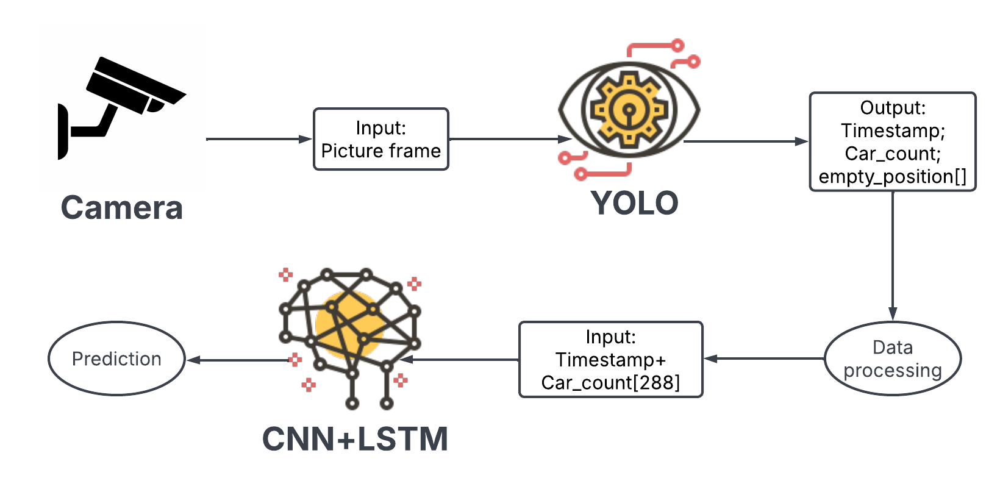
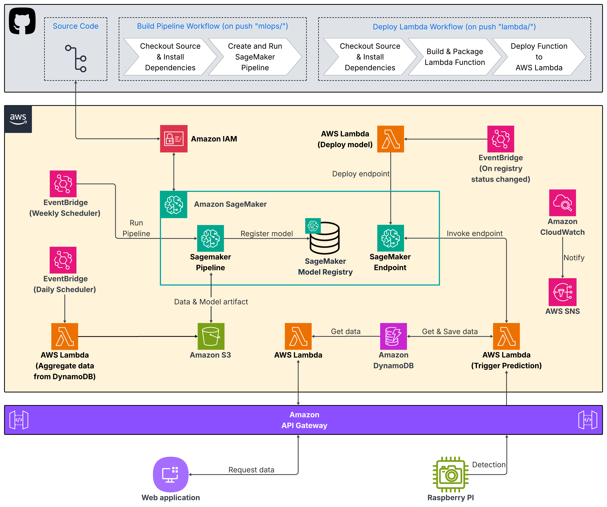
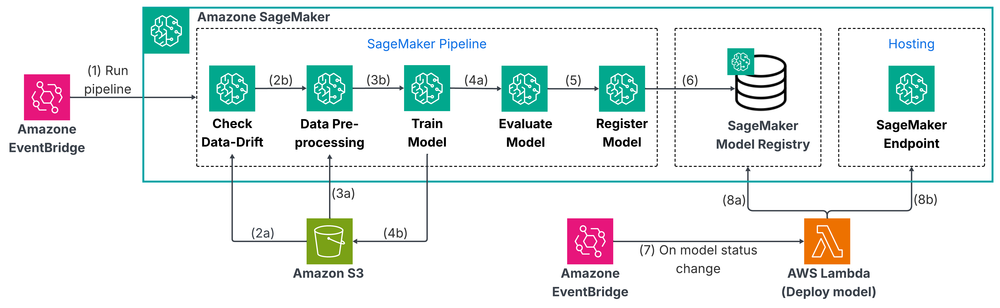

# **Dự án Bãi đỗ xe thông minh với MLOps**

**Đây là dự án xây dựng một hệ thống giám sát bãi đỗ xe thông minh phi máy chủ (Serverless), có khả năng dự đoán nhu cầu đỗ xe của người dùng trong tương lai và được tích hợp triển khai với các thành phần tự động hóa MLOps trên nền tảng AWS.**

## **Luồng hoạt động mô hình Deep Learning**

## **Kiến trúc Hệ thống**

* **Data/Model Storage: Amazon S3**  
   * **Lưu trữ dữ liệu lịch sử đỗ xe và kết quả dự đoán từ endpoint.**   
   * **Lưu trữ các artifacts (model, metrics, drift reports) của SageMaker Pipeline.**
   * **Lưu trữ các file metrics (metrics.json) và kết quả kiểm tra drift.**

* **Model Serving: Amazon SageMaker Serverless Endpoint**
   * **Deploy model, chỉ hoạt động khi được trigger.**
   * **Auto-scalling.**

* **Workflow Orchestration (MLOps): Amazon SageMaker Pipelines**

   * **Check dift >> Data Pre-processing >> Train model >> Evaluate model >> Register Model**
   * **Check Drift: So sánh dữ liệu thực tế và dự đoán để kiểm tra drift .**
   * **Processing: Tiền xử lý dữ liệu huấn luyện.**
   * **Train model: Huấn luyện mô hình với toàn bộ dữ liệu.**
   * **Evaluate model: Đánh giá so sánh mô hình đang được triển khai và mô hình mới train.**
   * **RegisterModel: Đăng ký model mới vào Model Registry với trạng thái Pending để đợi quyết định triển khai.**

* **Automation: AWS Lambda & EventBridge**
   * **run-prediction-trigger (Lambda): Kích hoạt dự đoán khi có RaspberryPI gửi dữ liệu tới API Gateway".**
   * **evaluate-promote-trigger (Lambda): Kích hoạt Deploy model khi có thay đổi trạng thái trong Model Registry .**
   * **daily-export-to-s3 (Lambda): Tổng hợp dữ liệu từ DynamoDB lưu vào S3".**

* **Monitoring: Amazon CloudWatch, Amazon SNS**
   * **Giám sát logs, gửi cảnh báo.**

## **Các Luồng Hoạt Động (Workflows)**

1. **Luồng Dự đoán Thời gian thực (Real-time Prediction).**
   * **Raspberry PI gửi kết quả nhận diện tới Gateway".**
   * **API Gateway kích hoạt hàm Lambda "run-prediction-trigger".**
   * **Lambda lưu trữ và lấy dữ liệu từ DynamoDB, gọi SageMaker Endpoint.**
   * **Lưu kết quả dự đoán vào DynamoDB và hiển thị ứng dụng Web.**

2. **Luồng Huấn luyện & Cập nhật Tự động (Automated Retraining).**
   * **EventBridge Scheduler kích hoạt Lambda tổng hợp dữ liệu hằng ngày từ DynamoDB**
   * **EventBridge Scheduler kích hoạt SageMaker Pipeline hằng tuần, phát hiện drift và tự động retrain mô hình**

3. **Workflow GitHub Action**
   * **Deploy Lambda: Cập nhật 2 Lambda functions khi có thay đổi trong thư mục "lambda/".**
   * **Build SageMaker Pipeline: Cập nhật và chạy lại pipeline mỗi khi có thay đổi trong thư mục "mlops/".**